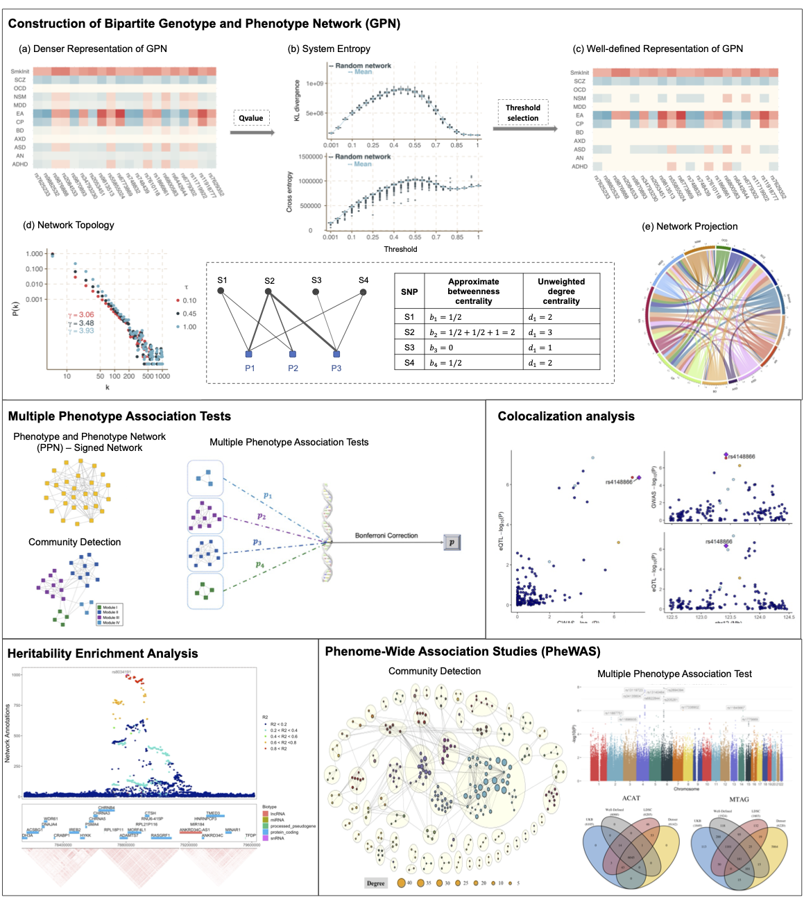

# Genotype and Phenotype Network (GPN)

A novel method for multiple phenotype association studies by constructing a bipartite signed network, linking phenotypes and genotypes into a Genotype and Phenotype Network (GPN), which is a new insight to investigate correlation among phenotypes. The GPN can be constructed by both quantitative and qualitative traits, especially phenotypes have extremely unbalanced case-control ratios. The bipartite network shelds the light to Multiple Phenotype Assotiation Test, Colocalization analysis, Heritability Enrichment analysis, and Phenome-Wide Association studies.

This package "GPN" includes the following parts:

- **Construction of bipartite GPN**: Construction of the Genotype and Phenotype Network with the individual-level phenotype and genotype data or GWAS Summary statistics; Then detect the well-defined representations of GPN by comparing the network properties with the random networks, including connectivity, centrality, and system entropy;
- **Community detection method**: Novel community detection method to partition K phenotypes into disjoint network modules based on the similarity matrix from GPN;
- **Multiple Phenotype Association Tests with and without considering the network modules**: test the association between K phenotypes with a SNP. The phenotypes can be either qualitative or binary, espectially the binary phenotypes with the extremely case-control ratio (the test statistics has been adjusted by the saddlepoint approximation)
  - ceCLC: Modified computational efficient clustering linear combination method
  - CLC: Modified clustering linear combination method
  - HCLC: Modified clustering linear combination method based on hierarchical clustering
  - MultiPhen: joint model of multiple phenotypes can increase discovery in GWAS
  - O'Brien: Modified O'Brien (SSU) method
  - Omnibus: Modified omnibus (Chi-square) method
  - TATES: Modified TATES method
  - ACAT: Cauchy combination method
- **Heritability Enrichment Analysis**: Construct network topology annotations of genetic variants that quantify the possibility of pleiotropy, and apply stratified linkage disequilibrium (LD) score regression to highly correlated phenotypes to identify enriched annotations. 


## Installation

You can install the released version of APGD from Github with:

``` r
devtools::install_github("xueweic/GPN")
library(GPN)
```

## Reference
Xuewei Cao, Shuanglin Zhang, Qiuying Sha*. A novel method for multiple phenotype association studies based on genotype and phenotype network.

Xuewei Cao #, Lirong Zhu #, Xiaoyu Liang, Shuanglin Zhang, Qiuying Sha*. Constructing genotype and phenotype network helps reveal disease heritability and phenome-wide association studies


**Any questions**? xueweic@mtu.edu; lirongz@mtu.edu


## Graphical Overview

<p align="center">
  
</p>

##### Construction of bipartite GPN
- **a – c.** Construction of the denser and well-defined representations of GPN by comparing the network properties with the random networks, including connectivity, centrality, and system entropy. Specifically, each phenotype and each SNP form a directed edge which represents the strength of the association, where the red color indicates that the minor allele of the SNP is a protective allele to the phenotype, and the blue color indicates that the minor allele of the SNP is a risk allele to the phenotype.
- **d.** The weighted degree distributions with different thresholds and the examples of two network topology annotations, approximate betweenness centrality and degree centrality, used in the heritability enrichment analysis; 
- **e.** The one-mode projection of GPN onto phenotypes that are linked through shared genetic architecture. Heritability enrichment analysis and phenome-wide association studies are introduced as two important applications of the constructed GPN.

##### Multiple Phenotype Assocaition Tests 
- **Construction of PPN.** Construction of a signed network, named the Phenotype and Phenotype Network (PPN), which is the one-mode projection of GPN on phenotypes. 
- **Community Detection.** The powerful community detection method is used to partition phenotypes into disjoint network modules with different colors. 
- **Multiple Phenotype Assocaition Tests.** Multiple phenotype association tests are applied to test the association between phenotypes in each of the network modules and a SNP, then the Bonferroni correction is used to obtain the overall p-value.
- **Colocalization analysis.** Colocalization of GWAS signals and eQTL analysis.

##### Heritability Enrichment Analysis 
- **Enrichment Analysis** Construct network topology annotations of genetic variants that quantify the possibility of pleiotropy, and apply stratified linkage disequilibrium (LD) score regression to highly correlated phenotypes to identify enriched annotations. The constructed network topology annotations are informative for disease heritability after conditioning on a broad set of functional annotations from the baseline-LD model.


